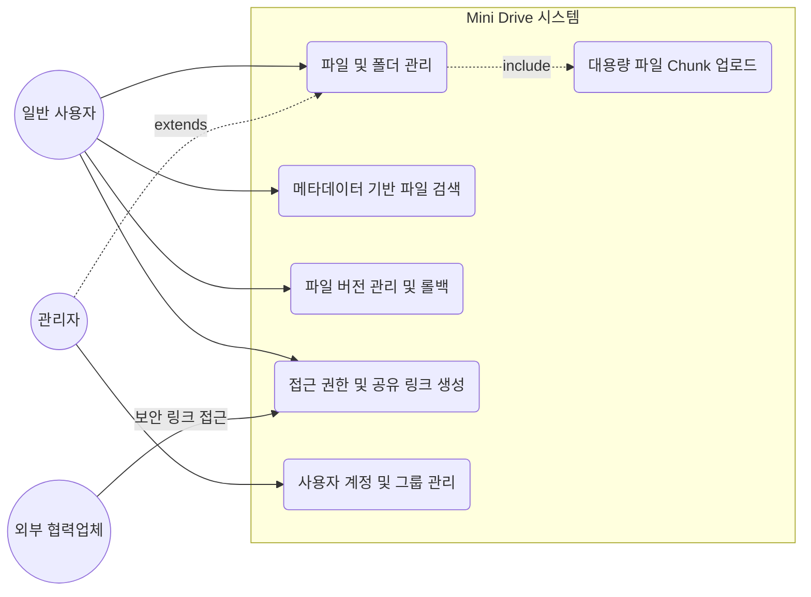
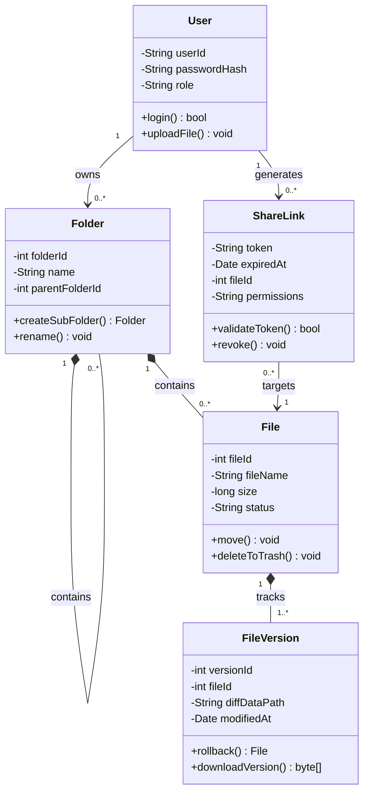
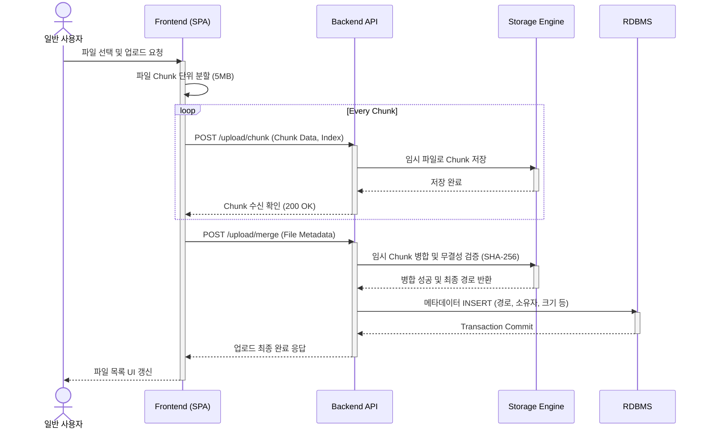
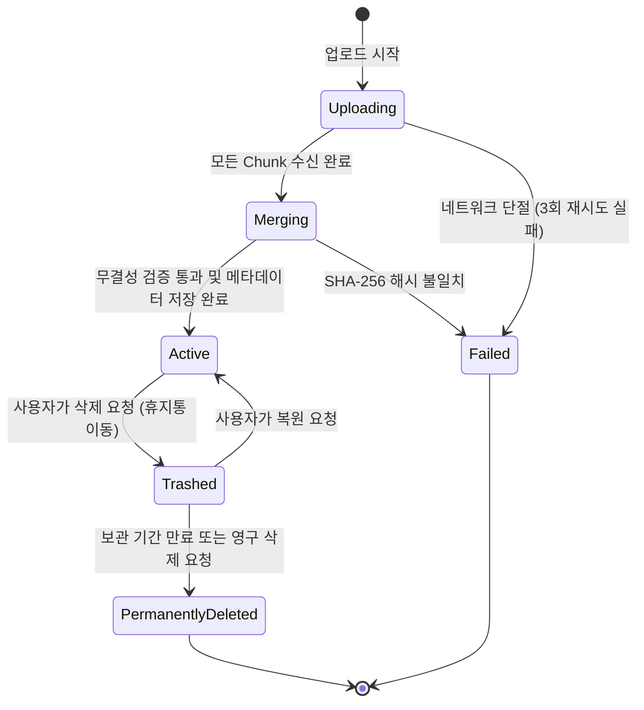

# 미니 드라이브 요구사항 분석서

## 1. 서론

### 1.1 목적 및 범위
본 문서는 200명 규모의 사내 직원이 동시 접속하는 On-premise(구축형) 클라우드 스토리지 시스템인 '미니 드라이브(Mini Drive)'의 기능적, 구조적, 행위적 요구사항을 정의한다. 기존 이메일 및 메신저 기반 파일 공유의 한계(버전 관리 혼선, 검색 비효율, 외부 유출 리스크)를 극복하기 위해, 중앙 집중식 파일 스토리지 엔진, 메타데이터(Metadata) 기반 검색 시스템, 그리고 권한 제어 모듈의 설계 기준을 명세하는 것을 범위로 한다.

### 1.2 용어 정의
On-premise(구축형): 기업의 자체 인프라 장비(사내망)에 직접 소프트웨어를 설치하여 운영하는 방식.

Metadata(메타데이터): 파일명, 업로드 날짜, 파일 크기, 업로더, 버전 정보 등 데이터를 설명하기 위한 속성 데이터.

Chunk Upload(청크 업로드): 대용량 파일을 지정된 크기의 작은 조각(Chunk)으로 분할하여 순차적 또는 병렬로 전송하는 방식. 네트워크 단절 시 실패한 부분만 재전송하여 안정성을 높임.

Differential Storage(차분 저장): 파일이 수정되어 새로운 버전이 생성될 때, 전체 파일을 다시 저장하지 않고 변경된 블록(Diff)만 저장하여 스토리지 공간을 최적화하는 기법.

SPA(Single Page Application): 단일 페이지에서 브라우저 렌더링을 동적으로 처리하여 페이지 새로고침 없이 사용자 경험(UX)을 향상시키는 웹 아키텍처.

### 1.3 참조 문서

[프로젝트 관리 계획서](https://github.com/Anthony0966/SE/blob/main/doc/pmp.md)

[시스템 정의서](https://github.com/Anthony0966/SE/blob/main/doc/sys_def.md)

[요구사항 정의서](https://github.com/Anthony0966/SE/blob/main/doc/req_spe.md)

## 2. 시스템 개요

### 2.1 소프트웨어 문맥도

| actor | 역할 |
| :--- | :--- |
| user | 시스템에 로그인하여 파일/폴더를 관리하고, 권한을 설정하며 파일을 공유하는 주체 |
| admin | 사용자 그룹을 생성하고, 스토리지 할당량 및 전체 시스템 보안 정책을 관리하는 주체 |
| guest | 시스템에 직접 로그인하지 않고, 만료 기간이 설정된 보안 링크를 통해 특정 파일에만 접근/다운로드하는 객체 |
| strage engine | Chunk 데이터를 병합하고 실제 물리 디스크에 파일을 Read/Write 하는 내부시스템 |

### 2.2 기능 분류 및 설명

#### 2.2.1 유스케이스 다이어그램

#### 2.2.2 유스케이스 설명서
Use Case Name: 대용량 파일 Chunk 업로드를 수행한다.
- ID: UC-02
- Importance Level: High
- Primary Actor: 일반 사용자
- Brief Description: 사용자가 1GB 이상의 대용량 설계 파일 등을 업로드할 때, 브라우저 단에서 파일을 분할하여 서버로 전송하고 서버가 이를 안전하게 병합한다.

Normal Flow:
1. 사용자는 웹 브라우저(SPA) UI에서 업로드할 대용량 파일을 선택한다.

2. 프론트엔드는 파일을 일정한 크기(예: 5MB)의 Chunk로 분할한다.

3. 프론트엔드는 각 Chunk를 순차적으로 백엔드 API로 전송한다.

4. 백엔드는 수신된 Chunk를 임시 스토리지에 저장하고, 모든 Chunk의 수신이 완료되면 하나로 병합(Merge)한다.

5. 백엔드는 SHA-256 알고리즘을 통해 병합된 파일의 무결성을 검증한다.

6. 검증 완료 후 메타데이터(크기, 작성자, 업로드 시간 등)를 DB에 기록하고 사용자에게 업로드 성공 메시지를 반환한다.

- Alternative / Exceptional Flows:

  - 3.a1: 네트워크 불안정으로 특정 Chunk 전송이 실패할 경우, 프론트엔드는 실패한 Chunk부터 최대 3회 자동 재전송(Auto Retry)을 수행한다.

  - 5.a1: SHA-256 해시 검증이 실패할 경우, 시스템은 업로드 실패를 기록하고 병합된 임시 파일을 삭제한 뒤 사용자에게 재업로드를 요청한다.

## 3. 요구사항 명세

### 3.1 정적 분석 : 클래스 다이어그램

### 3.2 동적 분석 
- 시퀀스다이어그램

- 스테이트 머신 다이어그램

## 4. 인터페이스 분석

1. 사용자 인터페이스 (UI): 별도의 클라이언트 설치 없이 Chrome, Edge 등 모던 웹 브라우저 환경에서 동작하는 단일 페이지 애플리케이션(SPA) 형태로 구축한다.
  - 운영체제의 파일 탐색기와 유사한 Drag & Drop 방식의 UI/UX를 제공한다.

2. 소프트웨어 인터페이스 (API): Frontend와 Backend 간의 통신은 JSON 포맷 기반의 RESTful API 아키텍처를 따른다.
  - 인증 및 인가는 JWT(JSON Web Token)를 HTTP Only Cookie에 담아 통신한다.

3. 데이터베이스 인터페이스:  파일의 메타데이터, 사용자 권한 트리는 관계형 데이터베이스에 저장하며, 대용량 검색 최적화를 위해 파일명 및 업로더 컬럼에 B-Tree 인덱스를 구성한다.

## 5. 제약사항

1. 네트워크 환경: 파일 유출 방지를 위해 본 시스템은 철저히 사내망 내부(On-premise)에서만 구동되며, 외부 접속은 사내 VPN을 통해서만 허용된다.

2. 보안 프로토콜: 모든 프론트엔드-백엔드 간 통신 데이터는 무조건 HTTPS 프로토콜 상에서 AES-256 수준으로 암호화되어야 한다.

3. 하드웨어 및 성능 한계: 단일 하드웨어의 I/O 병목을 피하기 위해 200명의 동시 접속 환경에서 스토리지 엔진은 Non-blocking I/O(비동기 입출력) 방식으로 구현되어야 하며, 데이터베이스 트랜잭션의 데드락을 방지하기 위한 설계가 선행되어야 한다.

## 6. 요구사항 추적표

|요구사항 | 유스케이스id | 설명 | 구형객체/모 |
| :--- | :--- | :--- | :---|
|FR-001| UC-06 | 아이디/비밀번호기반 인증 | User.login()|
|FR-004| UC-02 | Chunk Upload 방식 적용 | Frontend 분할 로직, Storage Engine |
|FR-006| UC-03 | 메타데이터 기반 필터링 검색 | RDBMS Indexing, API|
|FR-009| UcC-04 | Diffential storage방식을 적용 | FileVersion 클래스|
|NFR-006| - | 패킷 도청 방지를 위한 HTTPS 적용 | Web Server Proxy 설정|
|NFR-009| UC-02 | 병합 시 SHA-256 무결성 검증 | 백엔드 File 처리 서비스|

## 7. 참고문헌 및 부록

[프로젝트 관리 계획서](https://github.com/Anthony0966/SE/blob/main/doc/pmp.md)

[시스템 정의서](https://github.com/Anthony0966/SE/blob/main/doc/sys_def.md)

[요구사항 정의서](https://github.com/Anthony0966/SE/blob/main/doc/req_spe.md)
